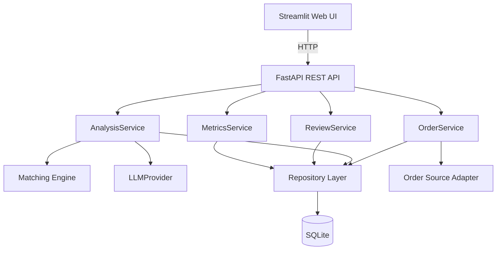
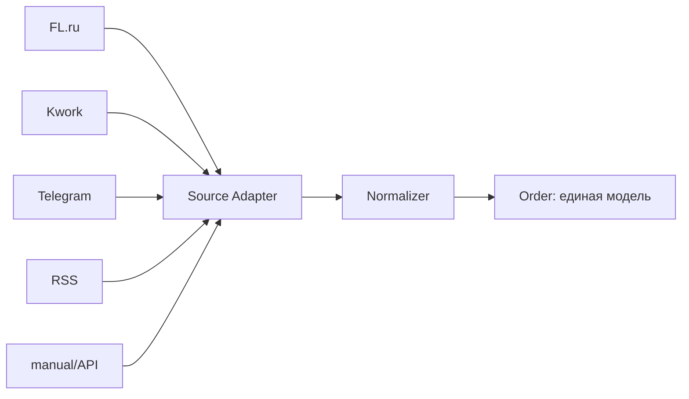
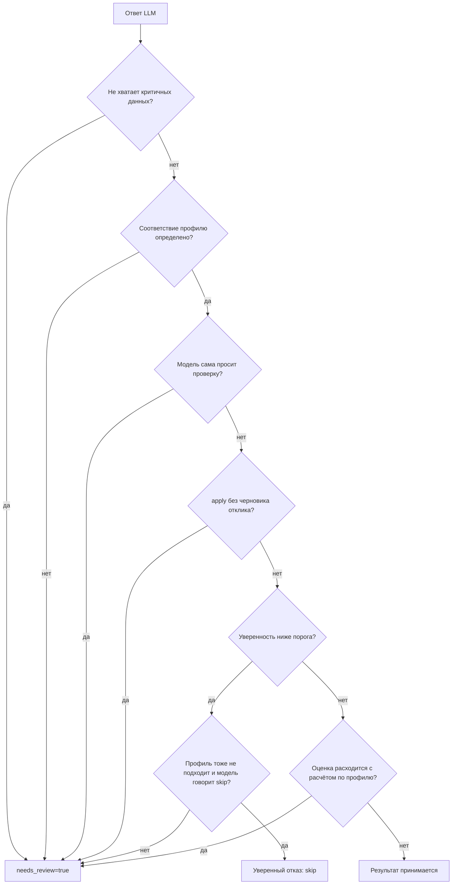

# Архитектура AI Freelance Copilot

## 1. Подход: модульный монолит

Микросервисы для учебного проекта избыточны, поэтому выбран модульный монолит с жёсткими
границами слоёв. Внутри кода есть возможность заменить любой компонент, не трогая остальные.



Слои и правило зависимостей:

| Слой | Каталог | Знает про |
|---|---|---|
| API | `app/api` | FastAPI, Pydantic-схемы, сервисы |
| Домен | `app/domain` | только свои модели и абстракции |
| Инфраструктура | `app/infrastructure` | SQLAlchemy, LLM SDK, HTTP |
| UI | `frontend/streamlit` | только HTTP API backend |

Домен не импортирует ни FastAPI, ни SQLAlchemy, ни конкретную LLM — поэтому `analysis_service.py`
не меняется ни при переходе `SQLite → PostgreSQL`, ни при замене `MockProvider → OpenAIProvider`.

## 2. Единая доменная модель



Любой источник (сейчас `manual`, в будущем FL.ru, Kwork, Freelance.ru, Telegram, RSS, webhook)
приводит данные к `ExternalOrder`, а `normalize_external_order()` превращает их в доменный
`Order`. Бизнес-логика не знает, откуда пришёл заказ, и подключать новый источник означает
добавить один класс, а не ветвление в сервисах.

## 3. Жизненный цикл заказа

```text
NEW → ANALYZING → ┬→ ANALYZED → APPROVED
                  ├→ NEEDS_REVIEW → ┬→ APPROVED
                  │                 └→ REJECTED
                  └→ ERROR
```

Статусы зафиксированы в `OrderStatus` (ТЗ §27), произвольные строки не используются.

## 4. Строгий контракт с моделью

`AnalysisResult` (`app/domain/models/analysis.py`) — единственный формат, в котором
результат ИИ выходит из сервиса:

```python
class AnalysisResult(BaseModel):
    match_score: float | None
    recommendation: Literal["apply", "skip", "review"]
    reason: str
    matched_skills: list[str]
    missing_skills: list[str]
    draft_reply: str | None
    needs_review: bool
    review_reason: str | None
```

Три валидатора, которые делают схему не декоративной, а рабочей:

1. `needs_review=true` требует непустой `review_reason`; `needs_review=false` требует `review_reason=null`.
2. `needs_review=true` требует `recommendation="review"` и `draft_reply=null` — то есть результат,
   ушедший человеку, **по построению безопасен**: без выдуманного числа и без готового к отправке текста.
3. `extra="forbid"` — модель физически не может протащить лишнее поле вроде `send_message`.

Невалидный JSON от модели не «разбирается как получится»: он превращается в
`LLMInvalidResponseError`, то есть в ручную проверку (ТЗ §29.3).

## 5. Бизнес-правила поверх мнения модели



Все шесть правил живут в `AnalysisService._apply_business_rules()`, и в аудит пишется список
сработавших правил (`business_rules_applied`) — решение системы всегда объяснимо.

Пороги настраиваются в `.env`: `MIN_DESCRIPTION_CHARS`, `MATCH_SCORE_REVIEW_THRESHOLD`,
`LLM_SCORE_CROSSCHECK_DELTA`, `MIN_DRAFT_REPLY_CHARS`.

## 6. Matching Engine: зачем второй, детерминированный расчёт

Если бы соответствие определяла только LLM, спорный результат невозможно было бы оспорить.
Поэтому есть независимый расчёт (`app/domain/matching.py`):

* лексикон навыков превращает текст заказа в список технологий (`Python`, `Telegram`, `Docker`, …);
* `match_score = |требования ∩ профиль| / |требования|`;
* если требований или профиля нет — возвращается `None`, а не `0`: «не смогли посчитать»
  и «ничего не совпало» — разные вещи.

Этот расчёт используется трижды: как оценка, как независимая проверка ответа модели (правило 6)
и как основа для рекомендации `skip` (правило 5).

## 7. Аудит

Таблица `audit_runs` фиксирует каждый запуск: `action`, `input`, `output`, `status`, `error`,
`duration_ms`. Ключевые свойства реализации:

* пишется **всё**, включая ошибки и неудачные попытки (ТЗ §29.4);
* при ошибке в БД не остаётся «полузаписи»: если обработчик вернул ошибку, сессия фиксируется,
  и запись аудита сохраняется — откатывается только настоящий внутренний сбой;
* чувствительные поля (`api_key`, `token`, `password`) маскируются в `AuditService`.

## 8. Будущее расширение (этапы 2–7 ТЗ)

| Этап | Что добавляется | Что НЕ меняется |
|---|---|---|
| 2. Реальные источники | `FlRuSource`, `KworkSource`, `RSSSource` | `OrderService`, домен |
| 3. Автосбор | планировщик + дедупликация | всё выше репозитория |
| 4. Профиль + RAG | векторный поиск по портфолио в генерации отклика | контракт `LLMProvider` |
| 5. Уведомления | `TelegramAction` через `ActionExecutor` | бизнес-логика |
| 6. Автодействия | `SendProposal` для явно разрешённых действий | правила §15 |
| 7. Агентная оболочка | OpenClaw/Hermes как клиент API | весь основной код остаётся своим |
