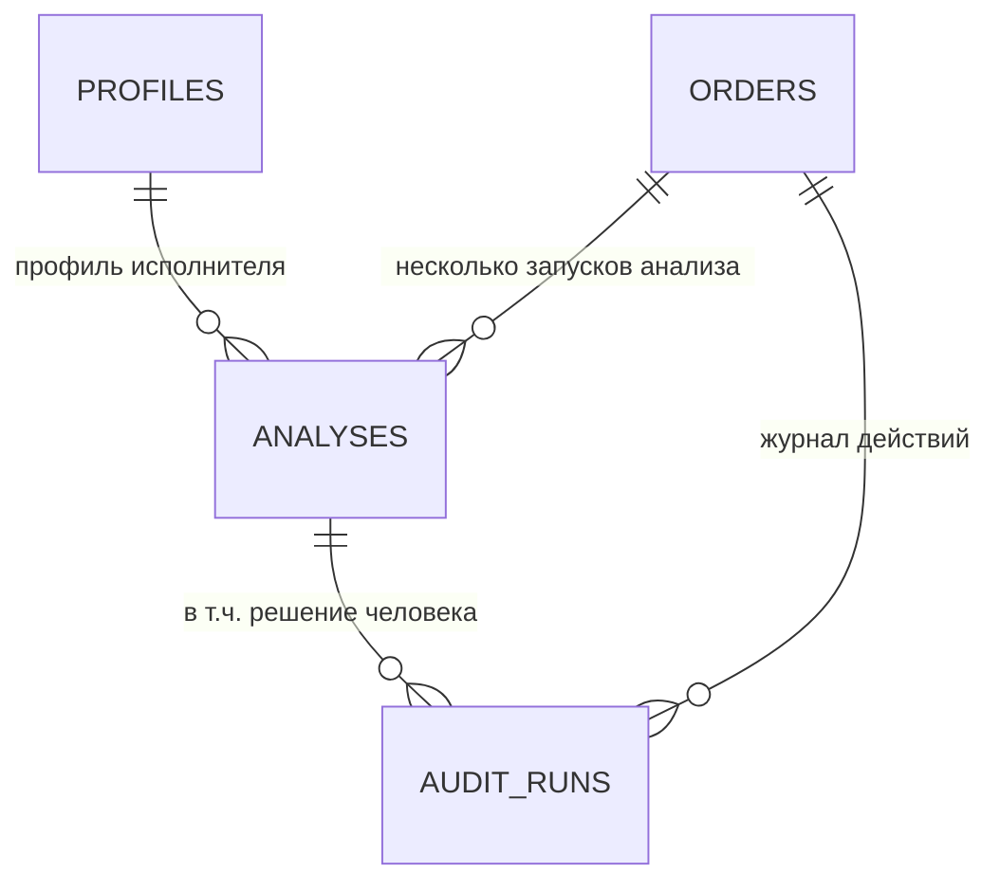

# Отчёт по выпускному проекту «AI Freelance Copilot»

Заготовка под шаблон из урока: разделы расположены в том порядке, который задан в требованиях
сдачи (ценность, сценарии, команды сервиса, схема данных, контроль качества, мини-экономика,
риски, план развития). Все фактические числа взяты из реальных прогонов и указаны с источником.
Места, где нужны ваши данные (замеры времени, скриншоты), помечены **[ВАШЕ]**.

---

## 1. Ценность

Фрилансер тратит время не на работу, а на отбор: просмотреть ленту, понять, подходит ли заказ,
прикинуть бюджет, написать отклик, отсеять мусор. Система берёт на себя первый проход и оставляет
человеку только спорные случаи.

Что даёт MVP:

- **разбор заказа за секунды**: соответствие профилю, рекомендация, совпавшие и недостающие навыки;
- **готовый черновик отклика** там, где решение уверенное;
- **честное «не знаю»** вместо выдуманных цифр: если в заказе нет бюджета или объёма работ,
  система не подставляет число, а отправляет заказ человеку с причиной;
- **восстановимая история решений**: по аудиту видно, почему система сказала «откликаться»,
  «пропустить» или «на проверку».

Главный принцип, который отличает это от «обёртки над LLM»: **модель говорит, что она считает,
а что системе разрешено делать — решает бизнес-логика**. Модель физически не может попросить
отправить сообщение клиенту: её ответ проходит проверку схемой и шесть правил, и результат,
ушедший на проверку человеку, по построению безопасен — без выдуманной суммы и без готового
к отправке текста.

## 2. Сценарии использования

Контур целиком: `ЗАКАЗ → ИИ-АНАЛИЗ → РЕШЕНИЕ → (человек) → АУДИТ`.

| # | Сценарий | Что делает система | Что видит человек |
|---|---|---|---|
| 1 | Подходящий заказ | `apply`, 86 %, черновик отклика | «можно откликаться», текст готов к правке |
| 2 | Смежная/частичная компетенция | `review`, уверенность ниже порога | заказ в очереди «требуют проверки» с причиной |
| 3 | Не хватает данных (нет бюджета) | `review`, `match_score = null` | причина «не указан бюджет», без выдуманных цифр |
| 4 | Чужой стек (Tilda, 1С, SEO, Flutter, PHP) | `skip` без человека | заказ просто не мешает: это уверенный отказ |
| 5 | Модель вернула мусор / упала | `review`, ошибка в аудите | заказ не потерян, приложение не упало |
| 6 | Человек принял решение | решение в аудите, статус заказа меняется | отметка «подтверждён»/«отклонён» |

Сценарий 4 стоит подчеркнуть: правило ручной проверки работает в обе стороны. Очередь
«требует проверки» — это действительно спорные случаи, а не свалка всего неподходящего.

## 3. Команды сервиса

Установка и запуск (Windows; для Linux/macOS путь к интерпретатору — `.venv/bin/python`):

```bash
git clone <ссылка на репозиторий> && cd AI_Freelance_Copilot
py -3.13 -m venv .venv
./.venv/Scripts/python.exe -m pip install -r requirements.txt
copy .env.example .env

./.venv/Scripts/python.exe -m uvicorn app.main:app --host 127.0.0.1 --port 8000   # backend
./.venv/Scripts/python.exe -m streamlit run frontend/streamlit/app.py             # панель
```

Точки доступа API:

| Команда | Назначение |
|---|---|
| `POST /api/v1/orders` | создать и нормализовать заказ (точка 1) |
| `GET /api/v1/orders` | витрина: фильтры `status`, `needs_review`, `source`, `recommendation`, `search`, пагинация (точка 2) |
| `POST /api/v1/orders/{id}/analyze` | запустить ИИ-анализ (точка 3) |
| `GET /api/v1/orders/{id}` | карточка заказа с анализами |
| `GET /api/v1/review-queue` | очередь ручной проверки |
| `POST /api/v1/analyses/{id}/review` | решение человека: `approved` / `rejected` |
| `GET /api/v1/audit`, `/api/v1/audit/actions` | журнал аудита и сводка по действиям |
| `GET /api/v1/metrics` | метрики и мини-экономика |
| `GET /api/v1/health` | состояние и активный провайдер LLM (в т.ч. `is_live`) |

Вспомогательные команды:

```bash
./.venv/Scripts/python.exe scripts/seed_demo.py          # 4 демо-заказа + анализ
./.venv/Scripts/python.exe scripts/run_tests_data.py     # прогон 15 сценариев + экспорт JSON/CSV
./.venv/Scripts/python.exe scripts/check_secrets.py      # ключи не уехали в репозиторий
docker compose up --build                                # backend + панель в контейнерах
```

## 4. Схема данных

SQLite, четыре таблицы, создаются автоматически при старте (`Database.create_all()`).



| Таблица | Что хранит | Ключевые поля |
|---|---|---|
| `orders` | заказы | `source`, `external_id` (дедупликация), `title`, `description`, `budget_min/max`, `status`, `needs_review`, `created_at` |
| `analyses` | результаты ИИ-анализа | `match_score`, `recommendation`, `reason`, `matched_skills`, `missing_skills`, `draft_reply`, `needs_review`, `review_reason`, `model_name`, `prompt_version`, `raw_response`, `duration_ms`, `review_decision` |
| `audit_runs` | журнал каждого действия | `action`, `order_id`, `analysis_id`, `status`, `input_payload`, `output_payload`, `error`, `duration_ms`, `created_at` |
| `profiles` | профиль исполнителя | `skills`, `normalized_skills`, `hourly_rate_rub`, `is_default` |

Полное описание с типами — `docs/ARCHITECTURE.md`, раздел 9. Жизненный цикл заказа:

```text
NEW → ANALYZING → ┬→ ANALYZED → APPROVED
                  ├→ NEEDS_REVIEW → ┬→ APPROVED
                  │                 └→ REJECTED
                  └→ ERROR
```

## 5. Контроль качества

**Тесты и линтер** (реальный вывод прогона):

```text
./.venv/Scripts/python.exe -m pytest             → 113 passed
./.venv/Scripts/python.exe -m pytest --cov=app   → покрытие app/ 96%
./.venv/Scripts/python.exe -m ruff check .       → All checks passed!
./.venv/Scripts/python.exe scripts/check_secrets.py → в репозиторий секреты не уезжают
```

Все тесты идут на `MockProvider`: ни одного сетевого вызова, ни одного потраченного рубля.

**Набор тестовых данных** `tests_data/` — 15 сценариев, 8 из них с ручной проверкой:

| Сценарий | Причина ручной проверки | Правило ТЗ |
|---|---|---|
| `S07_no_budget_long` | не указан бюджет | §14.1 |
| `S08_vague_short` | нет ни бюджета, ни объёма работ | §14.1 |
| `S09_partial_match` | уверенность модели ниже порога | §14.3 |
| `S11_analytics_borderline` | модель сама сообщила о неуверенности | §14.3 |
| `S12_llm_bad_json` | невалидный JSON модели | §14.2 |
| `S13_llm_timeout` | ошибка LLM, заказ в `error` | §14.5 |
| `S14_llm_no_draft` | `apply` без черновика отклика понижен до `review` | §14.4 |
| `S15_llm_inflated` | оценка модели расходится с расчётом по профилю | §14.6 |

**Сквозной прогон по живому API** (`scripts/run_tests_data.py`, mock-провайдер):

```text
Сценарии (15): все совпали со спецификациями, из них 8 → ручная проверка
Витрина (10 запросов): все совпали, включая ошибочный фильтр (HTTP 422)
Аудит: analyze_order 15, create_order 15, list_orders 10 — событие на каждое действие
метрики: json_valid_rate 0.8667, review_share 0.5333, avg_analyze_duration_ms 9.8
```

**Аудит как доказательство.** В `audit_runs` попадает каждое ключевое действие:
`create_order`, `analyze_order`, `review_decision`, а также неудачные запуски (timeout модели,
404 по несуществующему заказу) — с текстом ошибки. Это не «логи для отладки», а требование
проекта: по журналу восстанавливается, почему система приняла решение.

**Скриншоты** — 4 обязательных кадра описаны в `docs/DEMO_SCENARIO.md`.
**[ВАШЕ]**: сами снимки и записи экрана.

**Найденные и исправленные дефекты** (полный список — `docs/PROJECT_JOURNAL.md`): распад
in-memory SQLite между сессиями, потеря записи аудита при `HTTPException`, конфликт имён
`OrderSource`, порядок бизнес-правил (сверка оценки перехватывала правило низкой уверенности),
`localhost` → IPv6-конфликт с ретранслятором Docker.

## 6. Мини-экономика

Модель: `T_экономия = N × (T_вручную − T_с_системой)`; ставка `1500 ₽/час`
(`DEFAULT_HOURLY_RATE_RUB`).

| Показатель | Вручную | С системой | Разница |
|---|---|---|---|
| На один заказ | 13 мин **[ВАШЕ: замер]** | 3 мин **[ВАШЕ: замер]** | −10 мин |
| На 100 заказов | 21,7 ч | 5,0 ч | **−16,7 ч** |
| В деньгах (100 заказов) | 32 500 ₽ | 7 500 ₽ | **25 000 ₽** |

Фактическое среднее время ИИ-анализа берётся из аудита, а не из головы:
на mock-провайдере это 9,8 мс, на реальной модели — сотни миллисекунд (и это видно на экране
«Метрики и экономика» после переключения провайдера).

Важная деталь честности: метрики, которые нельзя посчитать (например, доля корректных JSON
при нуле анализов), возвращают **«нет данных»**, а не ноль. Иначе цель «ноль ошибок» выглядела
бы достигнутой на пустой базе.

## 7. Риски и как они закрыты

| Риск | Что могло бы случиться | Как закрыто |
|---|---|---|
| Модель придумывает бюджет | Отклик с несуществующей суммой уходит клиенту | Схема запрещает `match_score` без данных; правило §14.1 → `needs_review` |
| Модель вернула мусор | Приложение падает или пишет что попало | Невалидный JSON → `LLMInvalidResponseError` → безопасный результат + причина + аудит |
| Модель «попросила» отправить сообщение | Автодействие без согласия человека | `extra="forbid"` в схеме; действия в MVP запрещены (§22) |
| Модель завысила оценку | Слабый заказ выглядит выгодным | Независимый расчёт по профилю + сверка расхождения (§14.6) |
| LLM недоступна / timeout | Заказ теряется | Статус `error`, событие в аудите, приложение работает дальше |
| Ключ утекает в Git | Компрометация и деньги | `.env` в `.gitignore`, `.env.example` без значений, `check_secrets.py` в чек-листе |
| Ручная проверка превращается в свалку | Человек устаёт и перестаёт смотреть | Правило «уверенный отказ»: явно чужой стек уходит в `skip`, а не в очередь |
| Стоимость вызовов LLM | Непредсказуемые расходы | `mock` по умолчанию; `/api/v1/health` показывает `is_live`; один заказ вместо пакетного прогона при проверке |

## 8. План развития

Этапы после защиты (совпадают с ТЗ §22–§23 и заложенными интерфейсами):

1. **Реальные источники** — FL.ru, Kwork, Freelance.ru, Telegram, RSS как новые классы
   `OrderSource`; бизнес-логика не меняется.
2. **Автосбор** — планировщик → нормализация → дедупликация по `(source, external_id)`.
3. **Профиль и портфолио (RAG)** — выбор реальных проектов при генерации отклика.
4. **Уведомления** — Telegram-действие через `ActionExecutor`.
5. **Автоматические действия** — отправка отклика только после того, как human-in-the-loop
   докажет надёжность на статистике: доля `review`, доля принятых решений, доля ошибок.
6. **Агентная оболочка** — OpenClaw/Hermes как клиент этого API, а не вместо него:
   у системы уже есть контракт, аудит и метрики, которых агенту не хватает.

Ближайшие технические шаги: Alembic вместо `create_all()`, PostgreSQL вместо SQLite,
Celery/Redis для фоновых задач — всё это меняет инфраструктурный слой, не домен.

---

## Приложение: что в отчёт нужно добавить от вас

- [ ] Ссылка на репозиторий (remote пока не настроен).
- [ ] Скриншоты: успешный сценарий, ручная проверка с причиной, витрина, экспорт CSV.
- [ ] Замеры времени «вручную» и «с системой» — цифры 13/3 минуты сейчас оценочные.
- [ ] Демо-видео 2–4 минуты и защита 5–7 минут (раскадровка — `docs/DEMO_SCENARIO.md`).
- [ ] Опционально: один прогон на реальной модели (тратит деньги, только по вашей команде).
